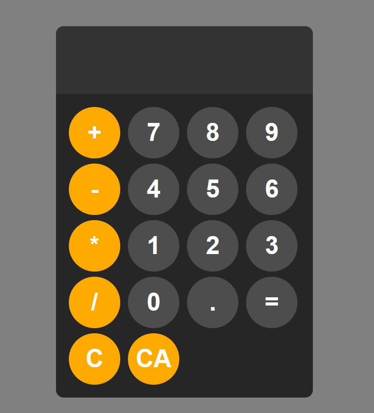

# Simple HTML/CSS/Javascript Calculator

This is a very simple calculator app made using pure HTML, CSS and Javascript  
The goal of this little project was to practice using grid boxes and styling with CSS

> [!WARNING]
This app uses an eval() function which can be used for XSS attacks, so please do not use this in a live app!